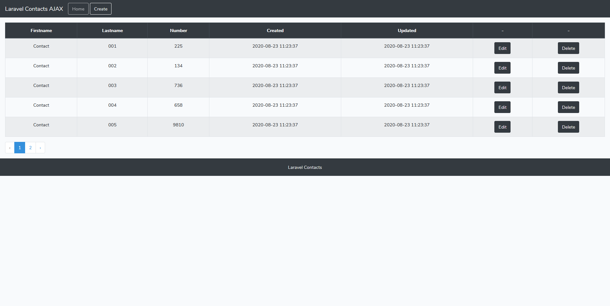
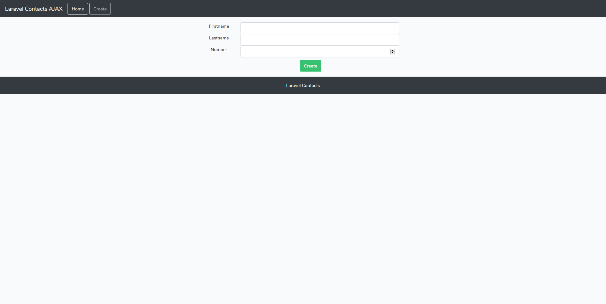
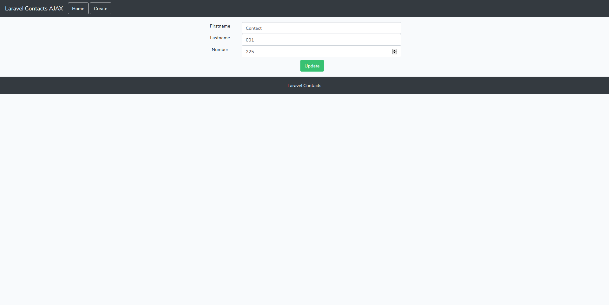
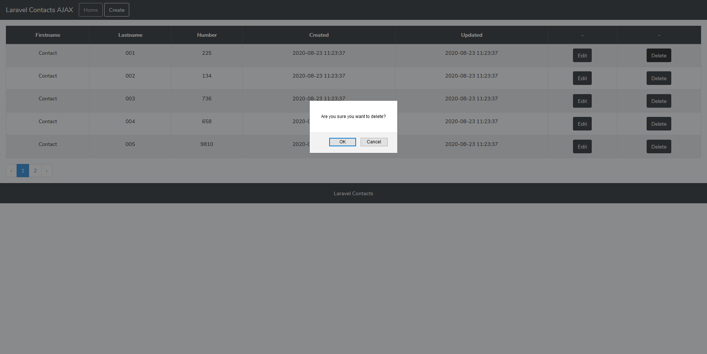
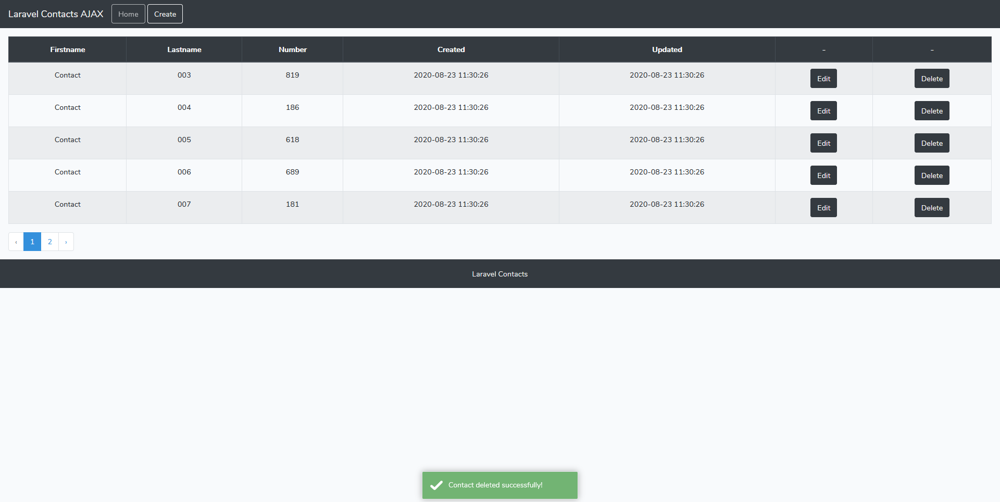

# Laravel Contacts AJAX

A simple Contacts application with basic AJAX CRUD.

## Installation

01. Clone the repository
```
git clone https://github.com/danielgogov-github/Laravel_Contacts_AJAX.git
```

02. Install all composer packages
```
composer install
```

03. Copy .env
```
cp .env.example .env
```

04. Set database, database username and database password
```
DB_DATABASE=laravel_contacts_authentication
DB_USERNAME=username
DB_PASSWORD=password
```

05. Generate application key
```
php artisan key:generate
```

06. Do migration
```
php artisan migrate
```

07. Fill the table with data
```
php artisan db:seed
```

08. Run the web server
```
php artisan serve
```

09. Visit the application
```
http://localhost:8000
```

## Features

01. Show all contacts
02. Create a new contact
03. Edit a contact
04. Delete a contact

## Screenshots 

```
Home
```


```
Create
```


```
Update
```


```
Delete
```


```
Deleted
```

